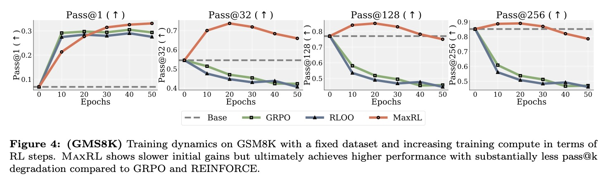

# 极大似然 - 交叉熵损失与MaxRL

> 大语言模型时代的强化学习 - 3

## 前言

此前我看到了一篇非常有趣的新论文，[Maximum Likelihood Reinforcement Learning](http://arxiv.org/abs/2602.02710)，文中为我们提供了一个考查RL算法的新角度，并据此提出了一种在RLVR任务效果上能够超过经典RL的新算法，称为MaxRL。它属于如果我在审稿中遇到会毫不犹豫给出满分的工作，理论性与实践效果俱佳！在本文当中我们就主要对这篇论文当中的结果做一些梳理和探讨，同时符号体系上我们仍遵循本系列blog的惯例，可能与原论文并不一致，可参见 [RL4LLM-ep1](https://zhuanlan.zhihu.com/p/1987273670977156594)。

MaxRL论文考虑的是RL算法当中的一个基础性问题，回顾此前我们对于RL算法的研究和推导都建立在这样一个基础之上，我们认定训练的最终目标就是最大化reward的期望，也就是：

$$
\mathcal{J}_{\mathrm{RL}}(\theta) = \mathbb{E}_{\mathbf{x} \sim \tilde{\mathcal{D}}, \mathbf{y} \sim \pi_\theta(\cdot | \mathbf{x})} [R(\mathbf{x}, \mathbf{y})]
$$

但是这未必总是各种情形下最优的选择。MaxRL所做的事情就相当于将训练目标替换为了：

$$
\mathcal{J}_{\mathrm{ML}}(\theta) = \mathbb{E}_{\mathbf{x} \sim \mathcal{D}} \left[\log \mathbb{E}_{\mathbf{y} \sim \pi_\theta(\cdot | \mathbf{x})} [R(\mathbf{x}, \mathbf{y})]\right]
$$

并在此基础上推导了一系列性质以及算法实现，并通过实验验证了其有效性。后面我们就来详细讨论一下这一新算法的性质和生效的原理。

## 交叉熵损失与极大似然估计

极大似然估计是统计当中经常使用到的估计方法，尽管在很多时候它并不能给出理论上最优的结果，但通常都具有不错的性质。在大语言模型的预训练和监督微调两个阶段当中所使用的交叉熵损失函数 (Cross Entropy Loss, CEL) 本质上就是在优化一个极大似然目标。在这两个阶段的训练当中我们的训练损失函数具体就写作

$$
\mathcal{L}_{\mathrm{CEL}}(\theta) = -\mathbb{E}_{\mathbf{x} \sim \mathcal{D}} [\log \pi_\theta(\mathbf{x})] = -\mathbb{E}_{\mathbf{x} \sim \mathcal{D}} \left[\sum_i \log \pi_\theta(x_i | x_{< i})\right]
$$

我们可以如此考虑它的构造方式，这里 $\mathbf{x}$ 是一段从数据集 $\mathcal{D}$ 当中选取的数据，而生成式的语言模型生成出这段文本的概率，或者似然就是

$$
L(\mathbf{x}, \pi_\theta) = \pi_\theta(\mathbf{x}) = \prod_i \pi_\theta(x_i | x_{< i})
$$

在实践当中为了数值稳定考虑一般训练目标会使用对数似然，即 $\log L(\mathbf{x}, \pi_\theta) = \sum_i \log \pi_\theta(x_i | x_{< i})$，不难看出两者的极值点总是相同的，而对数似然作为优化目标实际上还会有一些其他的好处。不难看出这基本上就是我们所使用的交叉熵损失了，只是作为损失函数有一些符号上的差别，同时对整个数据集取了期望 (注意只有对对数似然取期望是合理的，原似然值不能直接取期望作为训练目标，这一点读者可自行推导体会)。而后大模型这两个阶段的训练目标就很容易理解了，它就是希望最大化复刻数据集当中文本数据，并记住它们的能力。

## MaxRL的相关理论

### 训练目标来源

在研究MaxRL算法之前我们首先需要回答一个问题，即为什么需要对训练目标做这样的修改，以及为什么它会有效。在大模型算法研究当中这可能是最重要的问题之一。虽说我们难以知晓研究者在设计算法时真实的深度思考过程，但我们仍可以从几个角度对它做一些解释。

首先我们知道经典的RL算法所研究的是一种针对抽象的 (而且通常是离散的) reward目标进行优化的方法，并且由此衍生出了大量的研究工作。在很长一段时间内人们的一大研究重心都放在如何定义和计算不同类型的reward上，而这常常使得算法变得很复杂。但自从2025年初DeepSeek-R1发布后，大模型领域的RL reward就渐渐开始朝着越来越简化的方向发展，尤其是针对单步数学推理问题而言，精确而简单的0-1 reward被证实几乎就是最有效的方法。

而这就给MaxRL这一工作提供了必要的背景，因为在这一简单的reward设定下，我们实际上可以对于一个给定的问题 $\mathbf{x}$ 和模型参数 $\theta$ 定义并估计出一个叫做「准确率」的东西：

$$
p_\theta(\mathbf{x}) = \mathbb{E}_{\mathbf{y} \sim \pi_\theta(\cdot | \mathbf{x})} [R(\mathbf{x}, \mathbf{y})]
$$

它实际上也就是模型对于这一给定问题所能获取的reward的期望。因此标准RL当中「最大化获取reward期望」这一训练目标就可以写成：

$$
\mathcal{J}_{\mathrm{RL}}(\theta) = \mathbb{E}_{\mathbf{x} \sim \mathcal{D}, \mathbf{y} \sim \pi_\theta(\cdot | \mathbf{x})} [R(\mathbf{x}, \mathbf{y})] = \mathbb{E}_{\mathbf{x} \sim \mathcal{D}} [p_\theta(\mathbf{x})]
$$

但实际上我们还有另一个考虑的方向。在准确率的观点下其实我们可以写出「语言模型能够回答正确」这一事件所对应的对数似然训练目标就是：

$$
\mathcal{J}_{\mathrm{ML}}(\theta) = \mathbb{E}_{\mathbf{x} \sim \mathcal{D}} \left[\log \mathbb{E}_{\mathbf{y} \sim \pi_\theta(\cdot | \mathbf{x})} [R(\mathbf{x}, \mathbf{y})]\right] = \mathbb{E}_{\mathbf{x} \sim \mathcal{D}} [\log p_\theta(\mathbf{x})]
$$

这也就是极大似然估计所引出的MaxRL算法。注意这个算法与标准RL是存在本质差别的，即它并不能够在RL框架下通过特定的reward计算方式实现出来。事实上两者对应的优化方向差异并不太大，不难写出

$$
\begin{aligned}
\nabla_\theta \mathcal{J}_{\mathrm{RL}} &= \mathbb{E}_{\mathbf{x}} [\nabla_\theta p_\theta(\mathbf{x})] \\
\nabla_\theta \mathcal{J}_{\mathrm{ML}} &= \mathbb{E}_{\mathbf{x}} \left[\frac{1}{p_\theta(\mathbf{x})} \nabla_\theta p_\theta(\mathbf{x})\right]
\end{aligned}
$$

但我们却实际上可以推导出两者非常多有趣的差异，如后文所述。

### Maclaurin展开与pass@k性质

MaxRL所带来的第一个有趣的性质就是这一训练目标对于 pass@k 性能的影响。pass@k 指标所衡量的就是当语言模型重复执行 $k$ 次任务时，其中存在一次能够正确完成的概率。它在去年引发了非常广泛的争论，因为很多经过RL训练后的模型被证明只有 pass@1 的性能得到了有效的提升，而当 $k$ 值较高时其 pass@k 性能反而要低于训练前的基础模型。它的一大体现就是经过RL训练后的模型通常生成熵值明显降低，回复多样性受限。进而很多人认定RL算法并不能带来真正的智能，其性能上限已经被基础模型完全限定。

MaxRL算法即相关的理论分析则实际上给我们带来了另一种正面的观点，即RL算法确实存在此前所发现的各种问题，但MaxRL却能够有效带来能力边界的有效拓展。我们首先从标准RL的训练目标出发来看待这一问题。实际上根据定义我们知道 $p_\theta(\mathbf{x}) = \mathrm{pass@1}_\theta$，也就是单步的准确率。因此RL的目标函数在RLVR设定下就可以写作：

$$
\mathcal{J}_{\mathrm{RL}}(\theta) = \mathbb{E}_{\mathbf{x} \sim \mathcal{D}} [p_\theta(\mathbf{x})] = \mathbb{E}_{\mathbf{x} \sim \mathcal{D}} [\mathrm{pass@1}_\theta]
$$

它实际的优化目标就是 pass@1 的性能表现，因此我们不难推测出这样的结果：

- RL训练后 (只要训练稳定) pass@1 的性能能够有效上升
- 对于其他的 pass@k 性能实际上没有太多保障

因此当 $k$ 值较大时它的性质和 pass@1 偏离较多，出现性能下降也是完全可能的事情。那么MaxRL又如何呢？实际上经过对对数函数的Maclaurin展开后就可以发现

$$
\mathcal{J}_{\mathrm{ML}}(\theta) = \mathbb{E}_{\mathbf{x}} [\log p_\theta(\mathbf{x})] = \mathbb{E}_{\mathbf{x}} \left[- \sum_{k=1}^{\infty} \frac{(1 - p_\theta(\mathbf{x}))^k}{k}\right] = \mathbb{E}_{\mathbf{x}} \left[\sum_{k=1}^{\infty} \frac{\mathrm{pass@k}_\theta - 1}{k}\right]
$$

其中实际上显式包含了所有的 pass@k 准确率，计算梯度之后理论上可以提升所有的 pass@k 性能！当然后续它的具体实现和实验表现也确实应证了这一结论。

同样地，根据Maclaurin展开式我们也可以定义一个截断的MaxRL目标函数，它对于后续的理论研究来说也很有价值

$$
\mathcal{J}_{\mathrm{ML}}^T = \mathbb{E}_{\mathbf{x}} \left[- \sum_{k=1}^{T} \frac{(1 - p_\theta(\mathbf{x}))^k}{k}\right]
$$

### MaxRL梯度的条件形式与估计方法

在前文当中我们所能分析的主要是精确MaxRL训练目标的理论性质，但在实践当中精确的目标函数是无法计算得到的，我们实际上只能够优化一个估计目标。因此在开始实验之前就必须要找到一个有效的估计方法。

首先我们引入一个MaxRL的另一个有趣的性质，即它的目标梯度实际上可以被改写为一个「条件形式」。

**定理1 (MaxRL梯度的条件形式)**：MaxRL训练目标函数在单例上的梯度可以被写作如下在正例上的条件形式：

$$
\nabla_\theta \mathcal{J}_{\mathrm{ML}} (\theta, \mathbf{x}) = \mathbb{E}_{\mathbf{y} \sim \pi_\theta(\cdot | \mathbf{x})} [\nabla_\theta \log \pi_\theta(\mathbf{y} | \mathbf{x}) \mid R(\mathbf{x}, \mathbf{y}) = 1]
$$

也即理论上相当于只在「结果正确」这一条件分布上采样并做梯度更新。

**证明**：

首先根据标准的RL算法当中的log derivative trick推导可知

$$
\nabla_\theta p_\theta(\mathbf{x}) = \nabla_\theta \mathbb{E}_{\mathbf{y}} [R(\mathbf{x}, \mathbf{y})] = \mathbb{E}_{\mathbf{y}} [R(\mathbf{x}, \mathbf{y}) \nabla_\theta \log \pi_\theta(\mathbf{y} | \mathbf{x})]
$$

那么接下来只需要根据MaxRL及条件期望的定义即可得到

$$
\begin{aligned}
\nabla_\theta \mathcal{J}_{\mathrm{ML}}(\mathbf{x}) &= \nabla_\theta \log p_\theta(\mathbf{x}) = \frac{\nabla_\theta p_\theta(\mathbf{x})}{p_\theta(\mathbf{x})} \\
&= \frac{\mathbb{E}_{\mathbf{y}} [R(\mathbf{x}, \mathbf{y}) \nabla_\theta \log \pi_\theta(\mathbf{y} | \mathbf{x})]}{\mathbb{E}_{\mathbf{y}} [R(\mathbf{x}, \mathbf{y})]} \\
&= \mathbb{E}_{\mathbf{y} \sim \pi_\theta(\cdot | \mathbf{x})} [\nabla_\theta \log \pi_\theta(\mathbf{y} | \mathbf{x}) \mid R(\mathbf{x}, \mathbf{y}) = 1]
\end{aligned}
$$

QED.

推导过程其实非常简单，但它却提供了MaxRL梯度的一个有效的估计方法，主要就是上面这个式子：$\frac{\nabla_\theta p_\theta(\mathbf{x})}{p_\theta(\mathbf{x})}$。此处分子一项就是标准RL的训练目标，已有较好的估计方法，而分母就是 pass@1 准确率，可以直接通过多次采样均值估计得到。接下来假设在对问题 $\mathbf{x}$ 的 $N$ 轮采样当中我们得到了 $K$ 个正例，此时相应构造出来的单例梯度估计方法就是：

$$
\begin{aligned}
\nabla_\theta \hat{\mathcal{J}}_{\mathrm{RL}} (\theta, \mathbf{x}) &= \frac{1}{N} \sum_{n=1}^{N} R(\mathbf{x}, \mathbf{y}_n) \nabla_\theta \log \pi_\theta(\mathbf{y}_n | \mathbf{x}) \\
\hat{p}_\theta(\mathbf{x}) &= \frac{K}{N} \\
\nabla_\theta \hat{\mathcal{J}}_{\mathrm{ML}} (\theta, \mathbf{x}) &= \frac{\nabla_\theta \hat{\mathcal{J}}_{\mathrm{RL}} (\theta, \mathbf{x})}{\hat{p}_\theta(\mathbf{x})} = \frac{1}{K} \sum_{n=1}^{N} R(\mathbf{x}, \mathbf{y}_n) \nabla_\theta \log \pi_\theta(\mathbf{y}_n | \mathbf{x})
\end{aligned}
$$

两者依然非常相像，仅仅是归一化系数上有所差别。注意此时当 $K = 0$，即没有正例时我们没有办法对MaxRL目标做出估计，因此会设定将估计量置0。

那么接下来我们就会很自然地遇到许多相关问题，如此构造出的估计量是否无偏，其方差如何，要如何控制方差以实现稳定训练呢？

实际上我们可以推出，上述估计量确实不是一个MaxRL目标的无偏估计，反而刚好是其N截断目标的无偏估计，也就是

**定理2 (MaxRL估计量的偏差性质)**：上述构造出的估计量 $\nabla_\theta \hat{\mathcal{J}}_{\mathrm{ML}} (\theta, \mathbf{x})$ 满足

$$
\mathbb{E}[\nabla_\theta \hat{\mathcal{J}}_{\mathrm{ML}} (\theta, \mathbf{x})] = \nabla_\theta \mathcal{J}_{\mathrm{ML}}^N (\theta, \mathbf{x})
$$

也即是N截断目标的无偏估计。

**证明**：

实际上这个估计量的偏差主要来自于 $K = 0$ 时更高阶的正确率无法准确估计所致。由于 $K = 0$ 时估计量会被置0，因此有

$$
\mathbb{E} [\nabla_\theta \hat{\mathcal{J}}_{\mathrm{ML}} (\theta, \mathbf{x})] = \mathbb{E} [\nabla_\theta \hat{\mathcal{J}}_{\mathrm{ML}} (\theta, \mathbf{x}) \mid K > 1] \mathbb{P}(K > 1)
$$

接下来我们首先计算这个条件期望，注意到 $R(\mathbf{x}, \mathbf{y})$ 只有0-1两种取值，而其中只有K个样本有1 reward，它们可以被视作是从「结果正确」这一条件概率当中采样得到的，因此根据定理1就有

$$
\mathbb{E} [\nabla_\theta \hat{\mathcal{J}}_{\mathrm{ML}} (\theta, \mathbf{x}) \mid K > 1] = \nabla_\theta \log p_\theta(\mathbf{x})
$$

接下来记 $p = p_\theta(\mathbf{x})$，直接计算即可得到

$$
\begin{aligned}
\mathbb{E} [\nabla_\theta \hat{\mathcal{J}}_{\mathrm{ML}} (\theta, \mathbf{x})] &= \nabla_\theta \log p_\theta(\mathbf{x}) \mathbb{P}(K > 1) \\
&= \frac{\nabla_\theta p}{p} \cdot (1 - (1 - p)^N) = \nabla_\theta p \sum_{k=1}^{N} (1 - p)^{k-1} \\
&= - \sum_{k=1}^{N} \frac{1}{k} \nabla_\theta (1-p)^k = \nabla_\theta \mathcal{J}_{\mathrm{ML}}^N (\mathbf{x})
\end{aligned}
$$

QED.

这确实是一个很有趣的结果，意味着如果我们使用它作为优化目标的话，至多也只能优化到 pass@N 的性能表现。而在有限采样量的限制下，我们实际上也很难突破这一点限制。对于MaxRL类的算法而言，增大并行采样量 $N$ 会同时存在两种效果，一是减小方差稳定训练，其二则是还可以减小偏差以取得更好的训练目标。后者在标准RL当中是没有的。

MaxRL的训练目标同样存在方差过大而不稳定的情况，因此需要一些类优势估计的方法来控制方差。但由于此时归一化系数 $1/K$ 是一个随机变量，直接的优势估计方法就无法使用。论文当中作者则使用了另一个简易的替代方案，即减去一个无条件的归一化均值

$$
V_N := \frac{1}{N} \sum_{n=1}^{N} \nabla_\theta \log \pi_\theta(\mathbf{y}_n | \mathbf{x})
$$

因此实际使用的估计量就变成了

$$
\nabla_\theta \hat{\mathcal{J}}_{\mathrm{ML}} (\theta, \mathbf{x}) = \sum_{n=1}^{N} \left(\frac{R(\mathbf{x}, \mathbf{y}_n)}{K} - \frac{1}{N}\right) \nabla_\theta \log \pi_\theta(\mathbf{y}_n | \mathbf{x})
$$

### 实验结果

有了上述的估计量后MaxRL算法实际实现起来就相当简单了。在这里我们仅列举部分关键的实验结果，更详细的内容可以参见原论文。

这里是原论文当中在一个toy model上的实验结果。他们使用了SmolLM2-360M-Instruct模型作为训练基础，在GSM8K数据集上进行了大量训练并测试了很多中间checkpoint的 pass@k 性能表现。可以看到MaxRL算法确实能够在能力范围内相比较基线模型取得 pass@k 性能的有效提升，而且各种行为表现都能很好地符合理论估计结果。
